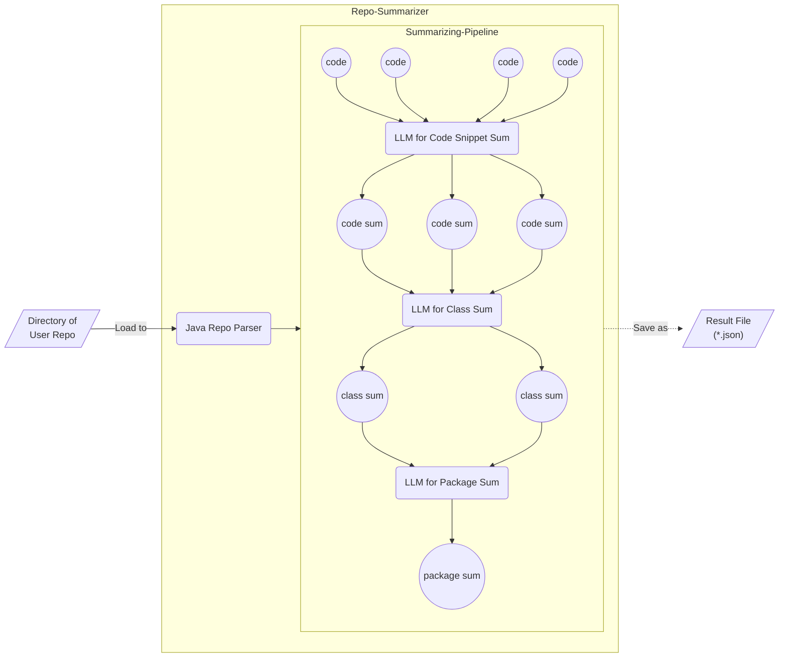

# Repo Summarizer

当程序员首次接触一个复杂软件项目源码时，首先了解源码的目录结构是比较明智的选择。通常项目目录结构的说明会由开发者进行维护，而人工维护会存在**费时、更新滞后**等问题。随着当下 CodeBERT、CodeT5 等用于处理代码相关任务大模型的出现，利用现有 LLM 的代码摘要能力**自动生成项目说明文档**将是一个值得探究的方向。

由于 LLM 存在输入 Token 上限，当前代码摘要任务的研究多停留在代码块或是单个文件层面。Repo Summarizer 项目的核心思路是利用 **LLM 的代码摘要能力** 配合 **自底向上的归并摘要方法** 实现代码目录结构描述文档的自动生成。

## 实现思路



- 在 Java 语言为主导的项目中，通常一个类（Class）对应一个`.java`文件，一个包（Package）则对应一个文件目录，并且一个包中可以存在子包，符合磁盘中实际存放的物理结构。同时得益于 Javadoc，Java 类与包的注释说明抓取便利，故**采用 Java 作为目标语言**。

- Java Repo Parser：**将整个 Repo 解析为树状结构**，包含以下节点类型：

  ```
  - Main Package: 最顶层目录

      - Sub Package：子目录，结构同顶层目录

      - Class：Java类

          - Method：类的方法，向下拆分时使用占位符

              - Code Snippet：方法中代码片段，向下拆分时使用占位符
  ```

  由于 LLM 存在输入 Token 上限，故将 Java 代码拆分为不超过一定大小的片段。

- LLM for Code Snippet Sum：直接使用 **Salesforce/codet5-base-multi-sum 模型**

- LLM for Class Sum / LLM for Package Sum：在 Salesforce/codet5-base-multi-sum 基础上进行微调

  - 对 Class 进行摘要的模型使用来源于 308 个开源项目的 32184 条数据进行微调（6:2:2）
  - 对 Package 进行摘要的模型使用来源于 308 个开源项目的 3903 条数据进行微调（6:2:2）

## 方法验证

_待补充_

## 运行所需依赖

- [**JDK 8+**](https://github.com/o1egl/paseto)（解析 Java 代码所需）

## 运行说明

_待补充_
