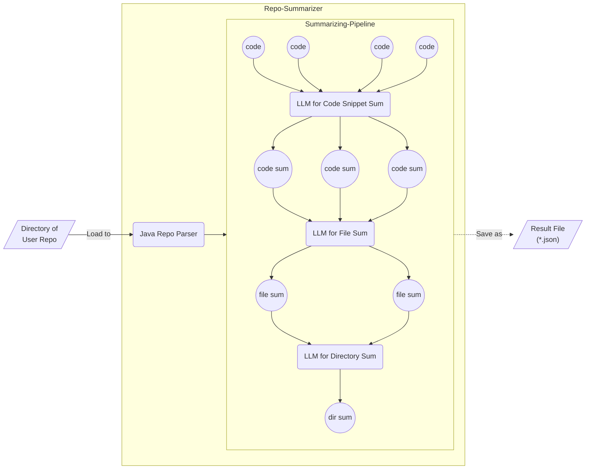

# Repo Summarizer

当程序员首次接触一个复杂软件项目源码时，首先了解源码的目录结构是比较明智的选择。通常项目目录结构的说明会由开发者进行维护，而人工维护会存在费时、更新滞后等问题。**Repo Summarizer** 的初衷即为解决以上问题。

## 实现思路

_待补全..._

## 架构图

## 运行所需依赖

- [**Java 17+**](https://github.com/o1egl/paseto)（解析 Java 代码所需）
